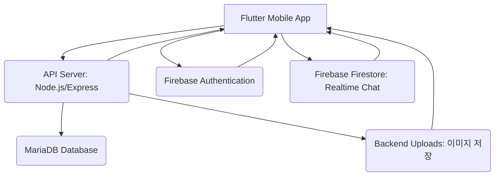

# 기술 요구사항 문서 (TRD)

## 1. 프로젝트 개요

'트래블 메이트'는 Flutter 기반의 모바일 커뮤니티 애플리케이션으로, 사용자가 여행 동반자를 찾고, 여행 정보를 공유하며, 1:1 실시간 채팅을 통해 소통할 수 있도록 지원합니다. 백엔드 서비스는 Firebase를 활용하여 인증·실시간 채팅(Firestore)을 처리하며, 이미지(프로필/게시글/일정)는 Node.js API 서버에서 수신·저장합니다. 핵심 데이터(사용자 프로필, 게시글, 일정 등)는 Node.js API 서버를 통해 MariaDB에 저장 및 관리됩니다.

## 2. 아키텍처 개요

본 프로젝트는 모바일 클라이언트, API 서버, 데이터베이스, 그리고 외부 클라우드 서비스로 구성된 다계층 아키텍처를 채택합니다.



### 2.1. 컴포넌트 설명

*   **Flutter Mobile App**: iOS 및 Android 플랫폼에서 동작하는 클라이언트 애플리케이션. 사용자 인터페이스 및 상호작용을 담당하며, API 서버 및 Firebase 서비스와 통신합니다.
*   **API Server (Node.js/Express)**: Flutter 앱의 요청을 받아 MariaDB와 상호작용하는 백엔드 서비스. 사용자 프로필, 커뮤니티 게시글, 여행 일정 등의 데이터를 관리하고 RESTful API를 제공합니다. Firebase Admin SDK를 통해 사용자 인증 토큰을 검증합니다.
*   **Firebase Authentication**: 사용자 로그인 및 인증(Google 로그인만 사용, 이메일/비밀번호 미지원)을 담당합니다. 사용자 ID 토큰을 발급하여 API 서버에 전달합니다.
*   **Firebase Firestore**: 1:1 실시간 채팅 기능을 위한 NoSQL 데이터베이스입니다. 메시지 데이터의 실시간 동기화를 처리합니다.
*   **Backend Uploads (Node.js)**: 프로필 사진, 게시글·일정 첨부 이미지를 API 서버가 수신하여 `uploads/` 디렉터리에 저장하고, 접근 URL을 반환합니다. (Firebase Storage 미사용)
*   **MariaDB Database**: 사용자 프로필 상세 정보, 여행 스타일, 커뮤니티 게시글, 여행 일정, 댓글, 좋아요 등 핵심 비즈니스 데이터를 관계형 모델로 저장합니다.

## 3. 기술 스택

| 영역          | 기술 스택                                          | 목적                                                         |
| :------------ | :------------------------------------------------- | :----------------------------------------------------------- |
| **모바일 앱** | Flutter (최신 버전)                                | 크로스 플랫폼 모바일 애플리케이션 개발                       |
|               | Provider/Riverpod                                  | 상태 관리                                                    |
|               | `dio`                                              | HTTP 통신 클라이언트                                         |
|               | `firebase_auth`                                    | Firebase 인증 연동                                           |
|               | `cloud_firestore`                                  | Firebase Firestore 연동 (실시간 채팅)                        |
|               | `image_picker`                                     | 이미지 선택 (업로드는 백엔드 API로 전송)                      |
|               | `shared_preferences` / `hive`                      | 로컬 데이터 저장 (간단한 설정, 캐싱)                         |
| **API 서버**  | Node.js (LTS)                                      | 백엔드 API 개발 런타임                                       |
|               | Express.js                                         | Node.js 웹 애플리케이션 프레임워크 (RESTful API 구현)        |
|               | Sequelize / TypeORM                                | MariaDB ORM (객체-관계 매핑)                                 |
|               | `firebase-admin`                                   | Firebase 서비스 관리 (ID 토큰 검증, FCM 발송 등)             |
|               | `dotenv`                                           | 환경 변수 관리                                               |
|               | `jsonwebtoken`                                     | 선택적으로 내부 서비스 간 토큰 발행/검증                     |
| **데이터베이스**| MariaDB (최신 안정 버전)                           | 관계형 데이터 저장 및 관리                                   |
|               | doc/travel_mate.sql                                | 초기 스키마 정의 (수동 적용 또는 DB 도구로 실행)              |
| **클라우드 서비스**| Google Cloud Platform (GCP) / AWS / Azure (배포 환경) | API 서버 호스팅, MariaDB 인스턴스 호스팅 (Cloud SQL, RDS 등), CDN 등 |
| **실시간 통신**| Firebase Firestore                                 | 1:1 실시간 채팅 메시지 동기화                                |
| **파일 저장** | Node.js API 서버 (multer, uploads/)                | 프로필·게시글·일정 이미지 수신 및 저장 (POST /api/upload/*)  |
| **알림**      | Firebase Cloud Messaging (FCM)                     | 푸시 알림 발송 (새 쪽지, 채팅, 댓글 등)                      |

## 4. 프로젝트 폴더 구조

```
.
├── travel_mate_app/                     # Flutter 모바일 애플리케이션
│   ├── lib/
│   │   ├── main.dart                    # 앱 진입점
│   │   ├── app/                         # 앱 공통 설정 (테마, 상수, 라우터)
│   │   ├── core/                        # 공통 유틸리티, 헬퍼, 서비스 (HTTP 클라이언트 등)
│   │   ├── data/                        # 데이터 레이어: 모델, API 클라이언트, 레포지토리 구현
│   │   │   ├── models/                  # 데이터 모델 정의 (ex: user_model.dart)
│   │   │   ├── datasources/             # API 호출, Firebase 연동 로직
│   │   │   └── repositories/            # 데이터 처리 로직 추상화 (인터페이스)
│   │   ├── domain/                      # 도메인 레이어: 엔티티, 유스케이스, 레포지토리 인터페이스 (클린 아키텍처 적용 시)
│   │   │   ├── entities/
│   │   │   ├── repositories/
│   │   │   └── usecases/
│   │   ├── presentation/                # UI 레이어: 위젯, 스크린, 상태 관리
│   │   │   ├── common/                  # 재사용 가능한 UI 위젯
│   │   │   ├── auth/                    # 인증 관련 UI (로그인, 회원가입)
│   │   │   ├── home/                    # 홈 스크린 UI
│   │   │   ├── profile/                 # 프로필 관리 UI
│   │   │   ├── matching/                # 동반자 매칭 UI
│   │   │   ├── community/               # 커뮤니티 게시판 UI
│   │   │   ├── chat/                    # 채팅 UI
│   │   │   └── itinerary/               # 여행 일정 공유 UI
│   │   └── utils/                       # 기타 유틸리티 함수
│   ├── pubspec.yaml                     # Flutter 종속성 관리 파일
│   ├── README.md
│   └── ...                              # 기타 Flutter 프로젝트 파일
├── travel_mate_backend/                  # Node.js/Express API 서버
│   ├── src/
│   │   ├── app.js                       # Express 앱 메인 설정 및 미들웨어
│   │   ├── config/                      # 데이터베이스 연결 설정, 환경 변수
│   │   ├── controllers/                 # 클라이언트 요청 처리 로직 (HTTP 핸들러)
│   │   ├── middlewares/                 # 인증, 에러 처리 미들웨어
│   │   ├── models/                      # 데이터베이스 모델 정의 (Sequelize/TypeORM)
│   │   ├── routes/                      # API 엔드포인트 라우팅 정의
│   │   ├── services/                    # 비즈니스 로직 처리 (컨트롤러에서 호출)
│   │   └── utils/                       # 공통 유틸리티 함수 (예: JWT 헬퍼)
│   ├── package.json                     # Node.js 종속성 관리 파일
│   ├── package-lock.json
│   ├── .env                             # 환경 변수 (민감 정보는 CI/CD 환경 변수로 관리)
│   ├── README.md
│   └── ...                              # 기타 Node.js 프로젝트 파일
├── doc/                                  # 프로젝트 문서 및 DB 스키마 (현행)
│   ├── travel_mate.sql                  # MariaDB 초기 스키마 정의 (DB 생성·초기화용, likes/bookmarks 대리키 포함)
│   ├── test.txt                         # 백엔드 API 케이스별 테스트 결과 정리
│   ├── trd.md                           # 기술 요구사항 문서
│   ├── prd.md                           # 제품 요구사항 문서
│   ├── todo.yaml                        # 태스크/할일 정의
│   ├── firebase.txt                     # Firebase 연동 가이드
│   └── firstvibe.json                   # 프로젝트 요약·QA 이력
└── README.md                             # 프로젝트 루트 README
```

## 5. 모듈별 기술 요구사항

### 5.1. 인증 및 사용자 관리 (`Auth & User Management`)

*   **목적**: 사용자 회원가입, 로그인, 프로필 관리 및 인증 시스템을 구축합니다.
*   **의존성**: Firebase Authentication, Node.js API Server, MariaDB, Backend Image Upload.

#### 5.1.1. 사용자 인증 (`User Authentication`)

*   **설명**: 사용자는 Google 로그인만 지원됩니다. 이메일/비밀번호는 수집·저장하지 않습니다.
*   **프론트엔드 (Flutter)**:
    *   **컴포넌트**: `LoginScreen`, `SignupScreen` (Google 로그인 버튼만 제공).
    *   **기능**:
        *   `google_sign_in` 패키지를 통한 Google 로그인 연동.
        *   로그인 성공 시 Firebase `User` 객체 및 `idToken` 획득.
        *   `idToken`으로 API 서버 `GET /api/auth/me` 호출하여 백엔드 사용자 ID(랜덤 영숫자) 획득.
        *   `Provider`를 사용하여 인증 상태 관리.
    *   **검증 기준**:
        *   Google 계정으로 로그인이 성공해야 합니다.
        *   인증 실패 시 적절한 오류 메시지가 사용자에게 표시되어야 합니다.
        *   로그인 성공 후 발급된 `idToken`은 로컬에 안전하게 저장되어야 합니다.
*   **백엔드 (Node.js API Server)**:
    *   **API 엔드포인트**:
        *   `POST /api/auth/register`: Firebase `idToken`을 받아 사용자(랜덤 id)를 MariaDB에 등록.
        *   `POST /api/auth/login`: Firebase `idToken`을 받아 사용자 조회 또는 생성 후 반환.
        *   `GET /api/auth/me`: 인증 시 현재 사용자 ID(랜덤 영숫자) 반환.
    *   **기능**:
        *   `firebase-admin` SDK로 `idToken` 검증 (`verifyIdToken`).
        *   토큰의 `uid`로 MariaDB `users` 조회 또는 랜덤 영숫자 `id`로 새 사용자 생성. 이메일은 저장하지 않음.
        *   MariaDB에 사용자 존재 여부 및 기본 정보 동기화.
    *   **검증 기준**:
        *   유효한 `idToken`으로 요청 시, MariaDB에 사용자(id, firebase_uid)가 기록되거나 확인되어야 합니다.
        *   유효하지 않은 `idToken`에 대해서는 401 Unauthorized 응답을 반환해야 합니다.
*   **데이터베이스 (MariaDB)**:
    *   **테이블**: `users`
    *   **스키마**:
        ```sql
        CREATE TABLE users (
            id VARCHAR(32) NOT NULL PRIMARY KEY COMMENT '랜덤 영숫자 사용자 ID',
            firebase_uid VARCHAR(255) UNIQUE NOT NULL,
            created_at DATETIME DEFAULT CURRENT_TIMESTAMP,
            updated_at DATETIME DEFAULT CURRENT_TIMESTAMP ON UPDATE CURRENT_TIMESTAMP
        );
        ```
    *   **검증 기준**:
        *   `id`는 서비스 내 사용자 식별자(랜덤 영숫자)이며 PK입니다. 이메일 컬럼은 없습니다.
        *   `firebase_uid`는 UNIQUE이며, 중복될 수 없습니다.

#### 5.1.2. 심층 프로필 관리 (`Detailed Profile Management`)

*   **설명**: 사용자는 여행 스타일, 관심사, 자기소개, 희망 동반자 유형 및 프로필 사진을 설정하고 편집할 수 있습니다.
*   **프론트엔드 (Flutter)**:
    *   **컴포넌트**: `ProfileEditScreen`, `ProfileDetailScreen`.
    *   **기능**:
        *   사용자가 여행 스타일(선택형 태그), 관심사(선택형 태그), 자기소개(자유 텍스트), 희망 동반자 유형(자유 텍스트)을 입력/선택할 수 있는 UI 제공.
        *   `image_picker`를 사용하여 갤러리/카메라에서 프로필 사진 선택 및 업로드 기능 제공.
        *   프로필 정보 수정 시, API 서버에 변경 사항 `PATCH` 요청.
        *   프로필 사진 변경 시, 백엔드 POST /api/upload/profile 로 이미지 업로드 후, 반환된 URL을 API 서버에 업데이트 요청.
    *   **검증 기준**:
        *   모든 프로필 필드가 정확히 저장되고 조회되어야 합니다.
        *   프로필 사진 업로드 및 변경 시, 새 사진이 즉시 반영되고 기존 사진은 대체되어야 합니다.
        *   유효하지 않은 이미지 형식(예: 너무 큰 파일)에 대한 에러 처리가 되어야 합니다.
*   **백엔드 (Node.js API Server)**:
    *   **API 엔드포인트**:
        *   `GET /api/users/{userId}/profile`: 특정 사용자의 상세 프로필 조회.
        *   `PATCH /api/users/{userId}/profile`: 사용자 프로필 정보 업데이트.
        *   `POST /api/users/{userId}/profile/image`: 프로필 이미지 URL 업데이트 (Flutter에서 백엔드 POST /api/upload/profile 업로드 후 호출).
    *   **기능**:
        *   MariaDB `user_profiles` 테이블에서 사용자 프로필 정보를 조회 및 업데이트합니다.
        *   이미지 파일은 클라이언트가 POST /api/upload/profile로 업로드하고, 반환된 URL을 이 API로 전달하여 MariaDB에 저장합니다.
        *   요청 시 JWT 또는 Firebase `idToken`을 사용하여 사용자 본인임을 확인하는 미들웨어를 적용합니다.
    *   **검증 기준**:
        *   프로필 업데이트 요청 시, MariaDB `user_profiles` 테이블의 해당 필드가 성공적으로 변경되어야 합니다.
        *   다른 사용자의 프로필은 조회만 가능하며, 수정은 불가능해야 합니다 (권한 검증).
*   **데이터베이스 (MariaDB)**:
    *   **테이블**: `user_profiles`, `profile_tags` (여행 스타일, 관심사 등)
    *   **스키마**:
        ```sql
        CREATE TABLE user_profiles (
            user_id INT PRIMARY KEY,
            nickname VARCHAR(50) UNIQUE NOT NULL,
            profile_image_url VARCHAR(2048),
            bio TEXT, # 자기소개
            preferred_travel_style TEXT, # 희망 여행 스타일
            preferred_companion_type TEXT, # 희망 동반자 유형
            gender VARCHAR(10),
            age_range VARCHAR(20),
            FOREIGN KEY (user_id) REFERENCES users(id) ON DELETE CASCADE
        );

        CREATE TABLE tags (
            id INT AUTO_INCREMENT PRIMARY KEY,
            tag_name VARCHAR(50) UNIQUE NOT NULL,
            tag_type VARCHAR(50) NOT NULL # 'travel_style', 'interest_activity'
        );

        CREATE TABLE user_profile_tags (
            user_id INT,
            tag_id INT,
            PRIMARY KEY (user_id, tag_id),
            FOREIGN KEY (user_id) REFERENCES users(id) ON DELETE CASCADE,
            FOREIGN KEY (tag_id) REFERENCES tags(id) ON DELETE CASCADE
        );
        ```
    *   **검증 기준**:
        *   `user_profiles` 테이블의 `user_id`는 `users` 테이블의 `id`를 외래 키로 참조해야 합니다.
        *   여행 스타일 및 관심사는 `tags` 테이블에 사전 정의된 값으로 관리되어야 합니다.
        *   `user_profile_tags`를 통해 다대다 관계가 명확하게 표현되어야 합니다.
*   **Backend Image Upload**:
    *   **기능**: POST /api/upload/profile 로 수신한 프로필 이미지를 서버 `uploads/profile/{userId}/` 에 저장하고 접근 URL을 반환합니다.
    *   **검증 기준**:
        *   업로드된 이미지는 안전하게 저장되고, 반환된 URL을 통해 접근 가능해야 합니다.
        *   (선택) 기존 프로필 이미지 변경 시 이전 파일 정리 정책을 적용할 수 있습니다.

#### 5.1.3. 개인정보 수정 및 탈퇴 (`Personal Info & Account Deletion`)

*   **설명**: 사용자는 자신의 개인정보를 수정하고, 회원 탈퇴를 요청할 수 있습니다.
*   **프론트엔드 (Flutter)**:
    *   **컴포넌트**: `AccountSettingsScreen`.
    *   **기능**:
        *   프로필(닉네임, 소개 등) 수정 UI 제공. (이메일 미수집이므로 이메일 변경 기능 없음)
        *   회원 탈퇴 버튼 제공 및 경고 메시지 표시.
        *   탈퇴 요청 시 API 서버에 `DELETE` 요청.
    *   **검증 기준**:
        *   개인정보 수정 시 유효성 검사를 수행하고 성공적으로 반영되어야 합니다.
        *   회원 탈퇴 시 사용자에게 최종 확인을 거쳐야 하며, 탈퇴 후 재로그인 시도 시 실패해야 합니다.
*   **백엔드 (Node.js API Server)**:
    *   **API 엔드포인트**:
        *   `DELETE /api/users/{userId}`: 사용자 계정 탈퇴.
    *   **기능**:
        *   클라이언트 요청 시 Firebase `idToken` 검증 후 `firebase-admin` SDK를 사용하여 Firebase Authentication에서 사용자 계정을 삭제합니다 (`deleteUser`).
        *   MariaDB `users` 및 `user_profiles` 테이블에서 해당 사용자 관련 모든 데이터를 삭제합니다. (`ON DELETE CASCADE` 설정 활용).
        *   관련된 게시글, 댓글 등 모든 사용자 생성 콘텐츠(UGC)도 처리 방침에 따라 삭제하거나 익명화합니다.
    *   **검증 기준**:
        *   사용자 탈퇴 요청 시, Firebase Auth 및 MariaDB에서 해당 사용자 정보가 완전히 삭제되어야 합니다.
        *   삭제된 사용자 관련 데이터(게시글, 댓글 등)는 정책에 따라 처리(삭제 또는 익명화)되어야 합니다.

### 5.2. 여행 동반자 매칭 (`Travel Companion Matching`)

*   **목적**: 사용자가 자신에게 맞는 여행 동반자를 검색하고, 소통하여 매칭을 성사시킬 수 있도록 지원합니다.
*   **의존성**: Node.js API Server, MariaDB, Firebase Firestore, Firebase Cloud Messaging.

#### 5.2.1. 동반자 검색 및 필터링 (`Companion Search & Filtering`)

*   **설명**: 사용자는 여행 목적지, 관심사, 기간, 성별, 연령대 등 다양한 조건으로 동반자를 검색할 수 있습니다.
*   **프론트엔드 (Flutter)**:
    *   **컴포넌트**: `CompanionSearchScreen`.
    *   **기능**:
        *   검색 조건(목적지, 관심사 태그, 여행 시작/종료일, 성별, 연령대 등)을 입력받는 UI 제공.
        *   입력된 조건으로 API 서버에 `GET /api/users/search` 요청.
        *   검색 결과를 카드 형태로 표시하며, 각 카드 클릭 시 상세 프로필로 이동.
        *   NFR1.1 (3초 이내 검색 결과 제공)을 충족하도록 로딩 스피너 등의 UX 요소 적용.
    *   **검증 기준**:
        *   필터링 조건에 따라 올바른 검색 결과가 반환되어야 합니다.
        *   검색 결과는 관련성 높은 순으로 정렬되어야 합니다 (백엔드 구현).
        *   필터링 조건 변경 시 즉시 결과가 업데이트되어야 합니다.
*   **백엔드 (Node.js API Server)**:
    *   **API 엔드포인트**: `GET /api/users/search`
    *   **쿼리 파라미터**: `?destination=paris&interest_tags=hiking,food&start_date=2023-10-01&end_date=2023-10-15&gender=male&age_min=25&age_max=35`
    *   **기능**:
        *   MariaDB `user_profiles` 및 `user_profile_tags` 테이블을 조인하여 쿼리 파라미터에 맞는 사용자 프로필을 검색합니다.
        *   검색 결과는 관련성(예: 매칭되는 태그 수, 최근 활동 등)에 따라 정렬하여 반환합니다.
        *   페이징(offset/limit) 기능을 포함하여 대량의 데이터 처리.
    *   **검증 기준**:
        *   다양한 필터링 조합에 대해 정확하고 효율적인 SQL 쿼리가 실행되어야 합니다.
        *   검색 결과는 MariaDB 데이터와 일치해야 합니다.
        *   쿼리 파라미터 유효성 검증 (예: 날짜 형식, 숫자 범위).
*   **데이터베이스 (MariaDB)**:
    *   **테이블**: `user_profiles`, `user_profile_tags`, `tags`.
    *   **스키마**: `user_profiles`, `tags`, `user_profile_tags` 테이블을 활용하여 검색.
    *   **검증 기준**:
        *   `user_profiles` 테이블의 관련 필드(예: `preferred_travel_style`, `preferred_companion_type`) 및 `user_profile_tags`에 적절한 인덱스가 적용되어야 합니다.

#### 5.2.2. 프로필 열람 및 비공개 쪽지 발송 (`Profile Viewing & Private Messaging`)

*   **설명**: 사용자는 다른 사용자의 상세 프로필을 열람하고, 관심 있는 동반자에게 비공개 쪽지(초기 연락용)를 보낼 수 있습니다.
*   **프론트엔드 (Flutter)**:
    *   **컴포넌트**: `UserProfileScreen`, `NewMessageScreen`.
    *   **기능**:
        *   `UserProfileScreen`에서 상대방의 상세 프로필 정보 및 '쪽지 보내기' 버튼 표시.
        *   '쪽지 보내기' 버튼 클릭 시 `NewMessageScreen`으로 전환되어 메시지 작성 및 전송.
        *   메시지 전송 성공 시 알림 (`showSnackBar` 등).
    *   **검증 기준**:
        *   다른 사용자의 프로필이 정상적으로 로드 및 표시되어야 합니다.
        *   쪽지 발송 시 메시지 내용이 성공적으로 전송되고, 발신자/수신자에게 모두 기록되어야 합니다.
        *   쪽지 발송 실패 시 사용자에게 알림이 제공되어야 합니다.
*   **백엔드 (Node.js API Server)**:
    *   **API 엔드포인트**:
        *   `GET /api/users/{userId}/profile`: 다른 사용자의 상세 프로필 조회.
        *   `POST /api/messages/private`: 비공개 쪽지 발송.
    *   **기능**:
        *   `GET /api/users/{userId}/profile` 요청 시, 해당 `userId`의 공개 프로필 정보를 MariaDB에서 조회하여 반환합니다.
        *   `POST /api/messages/private` 요청 시, `sender_id`, `receiver_id`, `content`를 받아 MariaDB `private_messages` 테이블에 저장합니다.
        *   쪽지 수신자에게 FCM을 통해 알림을 발송합니다 (`firebase-admin` SDK).
    *   **검증 기준**:
        *   프로필 조회 시 공개 가능한 정보(닉네임, 소개, 여행 스타일 등)만 반환합니다. (이메일은 수집하지 않음)
        *   쪽지 전송 시, 데이터베이스에 메시지가 정확하게 저장되고 발신 시간, 수신자 ID가 명확해야 합니다.
        *   FCM 알림이 정상적으로 수신자 기기에 전달되어야 합니다.
*   **데이터베이스 (MariaDB)**:
    *   **테이블**: `private_messages`
    *   **스키마**:
        ```sql
        CREATE TABLE private_messages (
            id INT AUTO_INCREMENT PRIMARY KEY,
            sender_id INT NOT NULL,
            receiver_id INT NOT NULL,
            content TEXT NOT NULL,
            sent_at TIMESTAMP DEFAULT CURRENT_TIMESTAMP,
            is_read BOOLEAN DEFAULT FALSE,
            FOREIGN KEY (sender_id) REFERENCES users(id) ON DELETE CASCADE,
            FOREIGN KEY (receiver_id) REFERENCES users(id) ON DELETE CASCADE
        );
        ```
    *   **검증 기준**:
        *   `sender_id`와 `receiver_id`는 `users` 테이블의 `id`를 외래 키로 참조해야 합니다.
        *   `is_read` 필드를 통해 메시지 읽음 여부를 관리할 수 있어야 합니다.

#### 5.2.3. 1:1 실시간 채팅 (`1:1 Realtime Chat`)

*   **설명**: 비공개 쪽지 발송 후 상대방이 수락하면 1:1 실시간 채팅방이 생성되어 구체적인 여행 계획을 논의할 수 있습니다.
*   **프론트엔드 (Flutter)**:
    *   **컴포넌트**: `ChatListScreen`, `ChatRoomScreen`.
    *   **기능**:
        *   `ChatListScreen`에서 현재 진행 중인 채팅방 목록을 표시. 각 채팅방에는 마지막 메시지 및 시간 표시.
        *   채팅방 클릭 시 `ChatRoomScreen`으로 이동, 과거 메시지 로드 및 실시간 메시지 전송/수신.
        *   메시지 입력 필드 및 전송 버튼 제공.
        *   NFR1.2 (1초 이내 메시지 전송/수신)을 충족하는 실시간 동기화 구현.
    *   **검증 기준**:
        *   메시지 전송 시 1초 이내에 상대방 기기에 메시지가 표시되어야 합니다.
        *   채팅방 입장 시 과거 메시지 기록이 정상적으로 로드되어야 합니다.
        *   채팅방 목록이 실시간으로 업데이트되어야 합니다.
*   **Firebase Firestore**:
    *   **데이터 모델**: `chats` (컬렉션) -> `{chat_id}` (문서) -> `messages` (서브컬렉션) -> `{message_id}` (문서).
    *   **기능**:
        *   `chat_id`는 `private_messages` 테이블의 ID 또는 두 사용자 ID를 조합한 고유한 값으로 생성.
        *   채팅 메시지는 `messages` 서브컬렉션에 `sender_id`, `receiver_id`, `content`, `timestamp` 등을 포함하여 저장.
        *   Firestore의 실시간 리스너를 사용하여 메시지 변경 사항을 클라이언트에 즉시 동기화.
    *   **검증 기준**:
        *   Firestore에 메시지가 성공적으로 저장되고, `timestamp`가 정확해야 합니다.
        *   Firestore 보안 규칙(Security Rules)을 사용하여 각 채팅방에 참여한 사용자만 메시지를 읽고 쓸 수 있도록 권한을 설정해야 합니다.
*   **백엔드 (Node.js API Server)**:
    *   **API 엔드포인트**:
        *   `POST /api/chat/room`: 초기 쪽지 수락 시 채팅방 생성 요청.
    *   **기능**:
        *   초기 비공개 쪽지 수락 시, MariaDB에 `chat_rooms` 관련 메타데이터 저장 및 Firestore에 초기 채팅방 문서 생성.
        *   (선택) `firebase-admin` SDK를 사용하여 Firestore 채팅방 생성/관리 로직을 서버에서 처리할 수 있으나, 클라이언트에서 직접 처리하는 것도 가능.
    *   **검증 기준**:
        *   채팅방 생성 요청 시 MariaDB와 Firestore에 관련 데이터가 일관성 있게 생성되어야 합니다.
*   **데이터베이스 (MariaDB)**:
    *   **테이블**: `chat_rooms`
    *   **스키마**: (Firestore의 `chat_id`와 연동되는 메타데이터)
        ```sql
        CREATE TABLE chat_rooms (
            id INT AUTO_INCREMENT PRIMARY KEY,
            firestore_chat_id VARCHAR(255) UNIQUE NOT NULL,
            user1_id INT NOT NULL,
            user2_id INT NOT NULL,
            created_at TIMESTAMP DEFAULT CURRENT_TIMESTAMP,
            FOREIGN KEY (user1_id) REFERENCES users(id) ON DELETE CASCADE,
            FOREIGN KEY (user2_id) REFERENCES users(id) ON DELETE CASCADE,
            CONSTRAINT unique_chat_room UNIQUE (user1_id, user2_id)
        );
        ```
    *   **검증 기준**:
        *   `user1_id`와 `user2_id`는 오름차순으로 저장하여 중복된 채팅방 생성을 방지합니다.
        *   `firestore_chat_id`는 Firestore 문서 ID와 일치해야 합니다.

#### 5.2.4. 알림 (`Notifications`)

*   **설명**: 새 쪽지, 새 채팅 메시지 수신 등 중요한 이벤트 발생 시 사용자에게 푸시 알림을 보냅니다.
*   **프론트엔드 (Flutter)**:
    *   **컴포넌트**: `firebase_messaging` 패키지.
    *   **기능**:
        *   앱 실행 시 FCM 토큰 획득 및 API 서버로 전송하여 사용자 정보와 매핑.
        *   백그라운드/포그라운드 메시지 수신 시 알림 처리 및 UI 업데이트.
    *   **검증 기준**:
        *   앱 재설치 후에도 FCM 토큰이 정상적으로 갱신되고 서버에 등록되어야 합니다.
        *   새 메시지 수신 시, 앱이 꺼져 있거나 백그라운드에 있을 때도 푸시 알림이 와야 합니다.
*   **백엔드 (Node.js API Server)**:
    *   **API 엔드포인트**: `POST /api/fcm/token`: 클라이언트의 FCM 토큰 등록/갱신.
    *   **기능**:
        *   MariaDB `fcm_tokens` 테이블에 사용자 ID와 FCM 토큰을 저장.
        *   새 쪽지/채팅 메시지 발생 시, `firebase-admin` SDK를 사용하여 해당 수신자의 FCM 토큰으로 푸시 알림 발송.
    *   **검증 기준**:
        *   FCM 토큰 등록 및 갱신이 성공적으로 이루어져야 합니다.
        *   새 메시지 발생 시, 수신자에게 지연 없이 푸시 알림이 발송되어야 합니다.
*   **데이터베이스 (MariaDB)**:
    *   **테이블**: `fcm_tokens`
    *   **스키마**:
        ```sql
        CREATE TABLE fcm_tokens (
            id INT AUTO_INCREMENT PRIMARY KEY,
            user_id INT NOT NULL,
            token VARCHAR(255) NOT NULL,
            device_type VARCHAR(50), # 'ios', 'android'
            created_at TIMESTAMP DEFAULT CURRENT_TIMESTAMP,
            updated_at TIMESTAMP DEFAULT CURRENT_TIMESTAMP ON UPDATE CURRENT_TIMESTAMP,
            FOREIGN KEY (user_id) REFERENCES users(id) ON DELETE CASCADE,
            UNIQUE (user_id, token) # 한 사용자가 여러 기기에서 로그인 가능
        );
        ```
    *   **검증 기준**:
        *   한 사용자가 여러 기기에서 로그인할 경우, 각 기기의 토큰이 모두 저장되어야 합니다.

### 5.3. 커뮤니티 및 정보 공유 (`Community & Information Sharing`)

*   **목적**: 사용자들이 여행 관련 정보를 자유롭게 공유하고, 질문/답변하며 소통하는 공개 커뮤니티 기능을 제공합니다.
*   **의존성**: Node.js API Server, MariaDB, Backend Image Upload.

#### 5.3.1. 공개 게시판 참여 (`Public Forum Participation`)

*   **설명**: 사용자는 자유롭게 새로운 게시글을 작성하고, 다른 사용자가 작성한 게시글을 열람하며 댓글을 달 수 있습니다.
*   **프론트엔드 (Flutter)**:
    *   **컴포넌트**: `CommunityScreen`, `PostDetailScreen`, `PostWriteScreen`.
    *   **기능**:
        *   `CommunityScreen`에서 최신 게시글 목록 표시 (카테고리별 필터링, 검색 기능 포함).
        *   게시글 작성 버튼 클릭 시 `PostWriteScreen`으로 이동, 제목, 내용 입력 및 게시글 카테고리 선택.
        *   `PostDetailScreen`에서 특정 게시글 내용, 이미지, 댓글 목록 표시.
        *   게시글에 댓글 작성 기능 제공.
    *   **검증 기준**:
        *   새 게시글 작성 후 즉시 목록에 표시되어야 합니다.
        *   카테고리 필터링 및 검색 기능이 정상 작동해야 합니다.
        *   게시글 상세 페이지에서 모든 내용(텍스트, 이미지)이 올바르게 표시되어야 합니다.
*   **백엔드 (Node.js API Server)**:
    *   **API 엔드포인트**:
        *   `GET /api/posts`: 게시글 목록 조회 (카테고리, 검색어, 페이징).
        *   `GET /api/posts/{postId}`: 특정 게시글 상세 조회.
        *   `POST /api/posts`: 새 게시글 작성.
        *   `PUT /api/posts/{postId}`: 게시글 수정.
        *   `DELETE /api/posts/{postId}`: 게시글 삭제.
    *   **기능**:
        *   MariaDB `posts` 테이블에 게시글 정보를 저장, 조회, 수정, 삭제합니다.
        *   `posts_categories` 테이블을 사용하여 카테고리 관리를 합니다.
        *   게시글 작성 시 사용자 ID와 연결하며, 수정/삭제 시 본인 확인을 위한 권한 검증.
        *   `image_urls`는 클라이언트가 POST /api/upload/post 로 업로드 후 받은 URL을 저장.
    *   **검증 기준**:
        *   게시글 CRUD 작업이 모두 정상 작동하며, 권한 없는 사용자의 수정/삭제는 방지되어야 합니다.
        *   카테고리 및 검색어에 따른 게시글 필터링이 정확해야 합니다.
*   **데이터베이스 (MariaDB)**:
    *   **테이블**: `posts`, `post_categories`
    *   **스키마**:
        ```sql
        CREATE TABLE post_categories (
            id INT AUTO_INCREMENT PRIMARY KEY,
            name VARCHAR(50) UNIQUE NOT NULL
        );

        CREATE TABLE posts (
            id INT AUTO_INCREMENT PRIMARY KEY,
            user_id INT NOT NULL,
            category_id INT NOT NULL,
            title VARCHAR(255) NOT NULL,
            content TEXT NOT NULL,
            image_urls JSON, # ['url1', 'url2']
            created_at TIMESTAMP DEFAULT CURRENT_TIMESTAMP,
            updated_at TIMESTAMP DEFAULT CURRENT_TIMESTAMP ON UPDATE CURRENT_TIMESTAMP,
            view_count INT DEFAULT 0,
            FOREIGN KEY (user_id) REFERENCES users(id) ON DELETE CASCADE,
            FOREIGN KEY (category_id) REFERENCES post_categories(id)
        );
        ```
    *   **검증 기준**:
        *   `user_id`는 `users` 테이블을, `category_id`는 `post_categories` 테이블을 참조해야 합니다.
        *   `image_urls`는 JSON 배열 형태로 여러 이미지를 저장할 수 있어야 합니다.
*   **Backend Image Upload**:
    *   **기능**: POST /api/upload/post 로 수신한 게시글 이미지를 서버 `uploads/posts/{userId}/` 에 저장하고 URL을 반환합니다.
    *   **검증 기준**:
        *   업로드된 이미지는 안전하게 저장되고, 반환된 URL을 통해 접근 가능해야 합니다.

#### 5.3.2. 여행 일정 및 경로 공유 (`Travel Itinerary & Route Sharing`)

*   **설명**: 사용자는 자신이 다녀온 여행의 상세 일정 및 경로를 작성하고, 사진과 지도를 첨부하여 다른 사용자와 공유할 수 있습니다.
*   **프론트엔드 (Flutter)**:
    *   **컴포넌트**: `ItineraryListScreen`, `ItineraryDetailScreen`, `ItineraryWriteScreen`.
    *   **기능**:
        *   `ItineraryListScreen`에서 공유된 여행 일정 목록을 표시.
        *   `ItineraryWriteScreen`에서 날짜별 활동, 숙소, 교통편 등 상세 일정 및 경로 입력 UI 제공.
        *   `image_picker` 및 (선택적으로) `google_maps_flutter`를 사용하여 사진 및 지도 첨부.
        *   `ItineraryDetailScreen`에서 공유된 일정 내용, 사진, 지도, 댓글 표시.
    *   **검증 기준**:
        *   일정 작성 시 상세 내용 및 첨부 파일이 모두 성공적으로 저장되어야 합니다.
        *   일정 상세 페이지에서 모든 정보가 시각적으로 명확하게 표시되어야 합니다.
        *   지도 첨부 시, 경로 정보가 지도상에 정확히 마커 또는 경로로 표시되어야 합니다.
*   **백엔드 (Node.js API Server)**:
    *   **API 엔드포인트**:
        *   `GET /api/itineraries`: 여행 일정 목록 조회 (필터링, 검색, 페이징).
        *   `GET /api/itineraries/{itineraryId}`: 특정 여행 일정 상세 조회.
        *   `POST /api/itineraries`: 새 여행 일정 작성.
        *   `PUT /api/itineraries/{itineraryId}`: 여행 일정 수정.
        *   `DELETE /api/itineraries/{itineraryId}`: 여행 일정 삭제.
    *   **기능**:
        *   MariaDB `itineraries`, `itinerary_days`, `itinerary_activities` 테이블에 여행 일정 정보를 저장, 조회, 수정, 삭제.
        *   `image_urls` 및 `map_data` (경로 좌표 등)는 JSON 형태로 저장.
        *   작성, 수정, 삭제 시 권한 검증.
    *   **검증 기준**:
        *   일정 CRUD 작업이 모두 정상 작동하며, 본인만 수정/삭제 가능해야 합니다.
        *   일정 상세 정보(날짜별 활동, 사진, 지도 데이터)가 정확히 저장되고 조회되어야 합니다.
*   **데이터베이스 (MariaDB)**:
    *   **테이블**: `itineraries`, `itinerary_days`, `itinerary_activities`
    *   **스키마**:
        ```sql
        CREATE TABLE itineraries (
            id INT AUTO_INCREMENT PRIMARY KEY,
            user_id INT NOT NULL,
            title VARCHAR(255) NOT NULL,
            description TEXT,
            start_date DATE NOT NULL,
            end_date DATE NOT NULL,
            destination VARCHAR(255),
            image_urls JSON, # ['url1', 'url2']
            map_data JSON, # { "type": "route", "coordinates": [[lat, lng], ...] }
            created_at TIMESTAMP DEFAULT CURRENT_TIMESTAMP,
            updated_at TIMESTAMP DEFAULT CURRENT_TIMESTAMP ON UPDATE CURRENT_TIMESTAMP,
            view_count INT DEFAULT 0,
            FOREIGN KEY (user_id) REFERENCES users(id) ON DELETE CASCADE
        );

        CREATE TABLE itinerary_days (
            id INT AUTO_INCREMENT PRIMARY KEY,
            itinerary_id INT NOT NULL,
            day_number INT NOT NULL,
            date DATE NOT NULL,
            notes TEXT,
            FOREIGN KEY (itinerary_id) REFERENCES itineraries(id) ON DELETE CASCADE
        );

        CREATE TABLE itinerary_activities (
            id INT AUTO_INCREMENT PRIMARY KEY,
            day_id INT NOT NULL,
            time TIME,
            activity_type VARCHAR(50), # e.g., '숙소', '교통', '관광', '식사'
            description TEXT NOT NULL,
            location_name VARCHAR(255),
            latitude DECIMAL(10, 8),
            longitude DECIMAL(11, 8),
            FOREIGN KEY (day_id) REFERENCES itinerary_days(id) ON DELETE CASCADE
        );
        ```
    *   **검증 기준**:
        *   일정은 `itineraries`, `itinerary_days`, `itinerary_activities` 테이블에 걸쳐 관계형으로 저장되어야 합니다.
        *   `image_urls` 및 `map_data`는 JSON 형태로 다양한 데이터를 수용할 수 있어야 합니다.
*   **Backend Image Upload**: (5.3.2 일정 공유) POST /api/upload/itinerary 로 수신한 이미지를 서버에 저장하고 URL을 반환합니다.

#### 5.3.3. 댓글 및 질문/답변 (`Comments & Q&A`)

*   **설명**: 게시글 및 여행 일정에 댓글을 달거나 질문을 하고, 다른 사용자의 질문에 답변할 수 있습니다.
*   **프론트엔드 (Flutter)**:
    *   **컴포넌트**: `CommentSectionWidget`.
    *   **기능**:
        *   게시글 및 일정 상세 페이지 하단에 댓글 입력 필드 및 댓글 목록 표시.
        *   댓글 작성 시 API 서버에 `POST` 요청.
        *   질문 작성 시 원 작성자에게 알림 (`firebase_messaging` 활용) 및 해당 사용자에게 알림 표시.
    *   **검증 기준**:
        *   댓글 작성 후 즉시 목록에 표시되어야 합니다.
        *   댓글 수정/삭제 시 본인만 가능해야 합니다.
        *   질문 작성 시 FCM 알림이 정상적으로 발송되어야 합니다.
*   **백엔드 (Node.js API Server)**:
    *   **API 엔드포인트**:
        *   `GET /api/posts/{postId}/comments`: 특정 게시글의 댓글 목록 조회.
        *   `POST /api/posts/{postId}/comments`: 특정 게시글에 댓글 작성.
        *   `PUT /api/comments/{commentId}`: 댓글 수정.
        *   `DELETE /api/comments/{commentId}`: 댓글 삭제.
        *   동일한 패턴으로 `itineraries`에 대한 댓글 엔드포인트 구현.
    *   **기능**:
        *   MariaDB `comments` 테이블에 댓글 정보를 저장합니다.
        *   댓글은 계층 구조(대댓글)를 가질 수 있도록 `parent_comment_id` 필드를 포함합니다.
        *   `firebase-admin` SDK를 사용하여 질문/답변 시 해당 콘텐츠 작성자에게 FCM 알림 발송.
    *   **검증 기준**:
        *   댓글 CRUD 작업이 정상 작동해야 합니다.
        *   대댓글 기능이 있다면, 계층 구조가 정확히 표시되어야 합니다.
        *   질문/답변 알림이 정확한 대상에게 발송되어야 합니다.
*   **데이터베이스 (MariaDB)**:
    *   **테이블**: `comments`
    *   **스키마**:
        ```sql
        CREATE TABLE comments (
            id INT AUTO_INCREMENT PRIMARY KEY,
            user_id INT NOT NULL,
            post_id INT,           # 게시글 댓글인 경우
            itinerary_id INT,      # 일정 댓글인 경우
            parent_comment_id INT, # 대댓글인 경우 부모 댓글 ID
            content TEXT NOT NULL,
            created_at TIMESTAMP DEFAULT CURRENT_TIMESTAMP,
            updated_at TIMESTAMP DEFAULT CURRENT_TIMESTAMP ON UPDATE CURRENT_TIMESTAMP,
            FOREIGN KEY (user_id) REFERENCES users(id) ON DELETE CASCADE,
            FOREIGN KEY (post_id) REFERENCES posts(id) ON DELETE CASCADE,
            FOREIGN KEY (itinerary_id) REFERENCES itineraries(id) ON DELETE CASCADE,
            FOREIGN KEY (parent_comment_id) REFERENCES comments(id) ON DELETE CASCADE,
            CHECK (post_id IS NOT NULL OR itinerary_id IS NOT NULL) # post_id 또는 itinerary_id 중 하나는 존재해야 함
        );
        ```
    *   **검증 기준**:
        *   `post_id` 또는 `itinerary_id` 중 하나만 `NULL`이 될 수 있도록 `CHECK` 제약조건을 사용합니다.
        *   `parent_comment_id`를 통해 대댓글 관계를 명확히 표현할 수 있어야 합니다.

#### 5.3.4. 콘텐츠 좋아요/북마크 (`Content Like/Bookmark`)

*   **설명**: 사용자는 게시글 및 여행 일정에 '좋아요'를 누르거나, '북마크'하여 나중에 다시 볼 수 있습니다.
*   **프론트엔드 (Flutter)**:
    *   **컴포넌트**: `LikeButtonWidget`, `BookmarkButtonWidget`.
    *   **기능**:
        *   게시글/일정 상세 페이지 및 목록에서 좋아요/북마크 버튼 표시.
        *   버튼 클릭 시 상태 토글 및 API 서버에 요청.
        *   사용자의 좋아요/북마크 여부에 따라 버튼 UI 변경.
    *   **검증 기준**:
        *   좋아요/북마크 상태 토글이 즉시 UI에 반영되어야 합니다.
        *   내 프로필 페이지 등에서 북마크한 콘텐츠 목록을 확인할 수 있어야 합니다.
*   **백엔드 (Node.js API Server)**:
    *   **API 엔드포인트**:
        *   `POST /api/posts/{postId}/like`: 게시글 좋아요/취소.
        *   `POST /api/itineraries/{itineraryId}/like`: 일정 좋아요/취소.
        *   `POST /api/posts/{postId}/bookmark`: 게시글 북마크/취소.
        *   `POST /api/itineraries/{itineraryId}/bookmark`: 일정 북마크/취소.
        *   `GET /api/users/{userId}/bookmarks`: 사용자가 북마크한 콘텐츠 목록 조회.
    *   **기능**:
        *   MariaDB `likes` 및 `bookmarks` 테이블에 사용자-콘텐츠 관계를 저장/삭제합니다.
        *   좋아요/북마크 요청 시, 이미 존재하면 삭제(취소), 없으면 생성.
    *   **검증 기준**:
        *   좋아요/북마크 수가 정확하게 집계되고, 사용자별 상태가 올바르게 관리되어야 합니다.
*   **데이터베이스 (MariaDB)**:
    *   **테이블**: `likes`, `bookmarks`
    *   **스키마**:
        ```sql
        CREATE TABLE likes (
            id INT AUTO_INCREMENT PRIMARY KEY,
            user_id INT NOT NULL,
            post_id INT,
            itinerary_id INT,
            created_at TIMESTAMP DEFAULT CURRENT_TIMESTAMP,
            FOREIGN KEY (user_id) REFERENCES users(id) ON DELETE CASCADE,
            FOREIGN KEY (post_id) REFERENCES posts(id) ON DELETE CASCADE,
            FOREIGN KEY (itinerary_id) REFERENCES itineraries(id) ON DELETE CASCADE,
            CHECK (post_id IS NOT NULL OR itinerary_id IS NOT NULL),
            UNIQUE (user_id, post_id), # 한 사용자는 한 게시글에 한 번만 좋아요 가능
            UNIQUE (user_id, itinerary_id) # 한 사용자는 한 일정에 한 번만 좋아요 가능
        );

        CREATE TABLE bookmarks (
            id INT AUTO_INCREMENT PRIMARY KEY,
            user_id INT NOT NULL,
            post_id INT,
            itinerary_id INT,
            created_at TIMESTAMP DEFAULT CURRENT_TIMESTAMP,
            FOREIGN KEY (user_id) REFERENCES users(id) ON DELETE CASCADE,
            FOREIGN KEY (post_id) REFERENCES posts(id) ON DELETE CASCADE,
            FOREIGN KEY (itinerary_id) REFERENCES itineraries(id) ON DELETE CASCADE,
            CHECK (post_id IS NOT NULL OR itinerary_id IS NOT NULL),
            UNIQUE (user_id, post_id),
            UNIQUE (user_id, itinerary_id)
        );
        ```
    *   **검증 기준**:
        *   `likes` 및 `bookmarks` 테이블은 `user_id`와 `post_id` 또는 `itinerary_id` 조합으로 `UNIQUE` 제약 조건을 가져야 합니다.

#### 5.3.5. 사용자 콘텐츠 신고 (`Content Reporting`)

*   **설명**: 사용자는 부적절한 게시글, 일정, 댓글 또는 사용자 프로필을 신고할 수 있습니다.
*   **프론트엔드 (Flutter)**:
    *   **컴포넌트**: `ReportButtonWidget`, `ReportSubmissionScreen`.
    *   **기능**:
        *   콘텐츠/프로필 상세 화면에 '신고하기' 버튼 제공.
        *   신고 유형 선택 및 상세 내용 입력 UI 제공.
        *   API 서버에 신고 내용 `POST` 요청.
    *   **검증 기준**:
        *   신고 제출 후 성공 메시지가 표시되어야 합니다.
        *   동일 콘텐츠에 대한 중복 신고는 방지되어야 합니다 (백엔드 처리).
*   **백엔드 (Node.js API Server)**:
    *   **API 엔드포인트**:
        *   `POST /api/reports/content`: 게시글, 일정, 댓글 신고.
        *   `POST /api/reports/user`: 사용자 프로필 신고.
    *   **기능**:
        *   MariaDB `reports` 테이블에 신고 내용을 저장합니다.
        *   신고 대상(게시글 ID, 일정 ID, 댓글 ID, 사용자 ID), 신고자 ID, 신고 유형, 상세 사유를 기록.
        *   관리자 시스템에서 신고를 검토하고 조치할 수 있도록 합니다. (본 TRD 범위 외)
    *   **검증 기준**:
        *   모든 신고가 정확하게 기록되고, 신고 대상 및 신고자 정보가 명확해야 합니다.
        *   하나의 신고 대상에 대해 한 사용자가 여러 번 신고할 수 없어야 합니다.
*   **데이터베이스 (MariaDB)**:
    *   **테이블**: `reports`
    *   **스키마**:
        ```sql
        CREATE TABLE reports (
            id INT AUTO_INCREMENT PRIMARY KEY,
            reporter_user_id INT NOT NULL,
            reported_post_id INT,
            reported_itinerary_id INT,
            reported_comment_id INT,
            reported_user_id INT,
            report_type VARCHAR(50) NOT NULL, # 'spam', 'hate_speech', 'inappropriate', 'other'
            reason TEXT,
            created_at TIMESTAMP DEFAULT CURRENT_TIMESTAMP,
            status VARCHAR(20) DEFAULT 'pending', # 'pending', 'resolved', 'rejected'
            FOREIGN KEY (reporter_user_id) REFERENCES users(id),
            FOREIGN KEY (reported_post_id) REFERENCES posts(id),
            FOREIGN KEY (reported_itinerary_id) REFERENCES itineraries(id),
            FOREIGN KEY (reported_comment_id) REFERENCES comments(id),
            FOREIGN KEY (reported_user_id) REFERENCES users(id),
            CHECK (reported_post_id IS NOT NULL OR reported_itinerary_id IS NOT NULL OR reported_comment_id IS NOT NULL OR reported_user_id IS NOT NULL),
            UNIQUE (reporter_user_id, reported_post_id, reported_itinerary_id, reported_comment_id, reported_user_id) # 중복 신고 방지
        );
        ```
    *   **검증 기준**:
        *   신고 대상 중 최소 하나는 존재해야 합니다.
        *   `status` 필드를 통해 신고 처리 상태를 추적할 수 있어야 합니다.

## 6. 비기능적 요구사항 (NFR)

### 6.1. 성능 (`Performance`)

*   **NFR1.1: 동반자 검색 및 필터링 결과는 3초 이내에 사용자에게 제공되어야 한다.**
    *   **기술적 접근**:
        *   MariaDB `user_profiles`, `user_profile_tags`, `tags` 테이블에 적절한 인덱스 생성 (특히 `tag_id`, `destination`, `age_range` 등에 대한 복합 인덱스).
        *   API 서버에서 SQL 쿼리 최적화 및 페이징 기법 적용.
        *   (선택) Redis와 같은 캐싱 계층을 도입하여 자주 조회되는 프로필 데이터를 캐시.
*   **NFR1.2: 1:1 실시간 채팅 메시지는 1초 이내에 전송 및 수신되어야 한다.**
    *   **기술적 접근**:
        *   Firebase Firestore의 실시간 동기화 기능을 활용합니다. Firestore는 웹소켓 기반으로 실시간 데이터 업데이트를 효율적으로 처리합니다.
        *   클라이언트 앱에서 Firestore 리스너를 최적화하여 불필요한 재렌더링 방지.
*   **NFR1.3: 이미지 업로드 및 로딩은 2초 이내에 완료되어야 한다.**
    *   **기술적 접근**:
        *   백엔드(Node.js)에서 이미지를 수신·저장하고, `/uploads` 정적 경로로 제공합니다. 필요 시 CDN 또는 리버스 프록시 캐싱 적용.
        *   Flutter 앱에서 이미지 로딩 시 `cached_network_image`와 같은 라이브러리를 사용하여 캐싱 처리.
        *   이미지 업로드 전 클라이언트에서 해상도 및 크기를 최적화(압축)하여 전송 시간을 단축합니다.

### 6.2. 보안 (`Security`)

*   **NFR2.1: 모든 사용자 데이터(프로필, 메시지 등)는 암호화되어 저장 및 전송되어야 한다.**
    *   **기술적 접근**:
        *   MariaDB 저장 데이터: 데이터베이스 수준에서 TDE(Transparent Data Encryption) 또는 컬럼 단위 암호화(MariaDB 10.1 이상 지원)를 고려할 수 있으나, 일반적으로 OS/파일 시스템 암호화와 네트워크 암호화를 우선합니다. MariaDB 자체에 중요한 평문 데이터(예: 비밀번호)는 저장하지 않으며, Firebase Auth가 처리합니다.
        *   데이터 전송: 모든 API 통신은 HTTPS/SSL을 통해 암호화되어야 합니다. Flutter `dio` 클라이언트 및 Node.js `express` 서버 모두 SSL 인증서를 적용합니다. Firebase 서비스(Auth, Firestore, Storage)는 기본적으로 HTTPS를 사용합니다.
*   **NFR2.2: 사용자 인증 및 권한 관리가 철저히 이루어져야 한다.**
    *   **기술적 접근**:
        *   **인증**: Firebase Authentication을 사용하여 강력한 사용자 인증을 제공합니다. 클라이언트에서 받은 Firebase `idToken`은 API 서버에서 `firebase-admin` SDK를 통해 매 요청마다 검증됩니다.
        *   **인가**: API 서버의 각 엔드포인트에 미들웨어를 적용하여, 요청 사용자가 해당 리소스에 접근하거나 수정할 권한이 있는지 확인합니다. (예: `userId`와 토큰의 `uid` 일치 여부 확인, 관리자 권한 여부 등). Firebase Firestore는 보안 규칙(Security Rules)을 사용하여 데이터 접근 권한을 세밀하게 제어합니다.
*   **NFR2.3: 비공개 쪽지 및 1:1 채팅 내용은 비인가 접근으로부터 보호되어야 한다.**
    *   **기술적 접근**:
        *   MariaDB에 저장되는 비공개 쪽지(`private_messages` 테이블)는 `sender_id`와 `receiver_id`를 기반으로 권한을 검증합니다.
        *   Firebase Firestore의 채팅 데이터는 보안 규칙을 통해 해당 채팅방에 참여한 사용자만 읽고 쓸 수 있도록 엄격하게 제한합니다.
        *   메시지 내용 자체를 엔드-투-엔드 암호화하는 것은 별도의 복잡한 구현이 필요하므로, 이 초기 단계에서는 전송 계층(HTTPS) 및 데이터 저장소 접근 제어에 집중합니다.
*   **NFR2.4: 개인정보 처리방침 및 서비스 이용약관을 명확히 제공해야 한다.**
    *   **기술적 접근**:
        *   앱 내에 개인정보 처리방침 및 서비스 이용약관 페이지를 구현합니다.
        *   사용자 가입 시 약관 동의 절차를 포함합니다.

### 6.3. 확장성 (`Scalability`)

*   **NFR3.1: 동시 사용자 10만 명 이상을 수용할 수 있도록 설계되어야 한다.**
    *   **기술적 접근**:
        *   **API 서버**: Node.js는 비동기 I/O 모델을 기반으로 하여 높은 동시성을 처리하는 데 유리합니다. API 서버는 Stateless하게 설계하여 수평 확장이 용이하도록 합니다 (로드 밸런서 뒤에 여러 인스턴스 배포). Google Cloud Run, AWS ECS/Fargate 등 서버리스 또는 컨테이너 기반 배포 환경을 활용하여 트래픽에 따라 자동 스케일링을 구현합니다.
        *   **데이터베이스**: MariaDB는 읽기 복제(Read Replicas)를 통해 읽기 요청을 분산하고, 필요시 샤딩(Sharding)을 고려할 수 있습니다. 초기 단계에는 충분한 리소스(CPU, RAM, IOPS)를 가진 고성능 인스턴스를 사용합니다.
        *   **Firebase 서비스**: Firebase Auth, Firestore는 Google 인프라 기반으로 확장성을 제공합니다. 이미지는 백엔드에서 저장·제공합니다.
*   **NFR3.2: 데이터베이스는 향후 데이터 증가에 유연하게 대응할 수 있는 구조여야 한다. (MariaDB 활용)**
    *   **기술적 접근**:
        *   정규화된 스키마 설계: 데이터 중복을 최소화하고 데이터 일관성을 유지합니다.
        *   적절한 인덱스 전략: 쿼리 성능을 최적화하고 데이터 증가에 따른 성능 저하를 방지합니다.
        *   파티셔닝: 특정 테이블의 데이터가 매우 커질 경우, 파티셔닝(예: 날짜별 파티셔닝)을 통해 관리를 용이하게 하고 쿼리 성능을 향상시킬 수 있습니다.
        *   MariaDB Cloud SQL (GCP) 또는 AWS RDS for MariaDB와 같은 관리형 데이터베이스 서비스를 사용하여 스케일업/스케일아웃 및 백업/복구 관리를 용이하게 합니다.
*   **NFR3.3: 신규 기능 추가 및 업데이트에 용이하도록 모듈화된 아키텍처를 지향한다.**
    *   **기술적 접근**:
        *   **클린 아키텍처 (Flutter)**: Flutter 앱은 `data`, `domain`, `presentation` 레이어로 분리하여 각 레이어의 독립성을 유지하고 의존성을 최소화합니다.
        *   **레이어드 아키텍처 (Node.js)**: API 서버는 `controllers`, `services`, `models` 등으로 역할을 분리하여 각 컴포넌트의 책임 범위를 명확히 합니다.
        *   모듈 간 명확한 인터페이스 정의를 통해 특정 모듈의 변경이 다른 모듈에 미치는 영향을 최소화합니다.

### 6.4. 사용성 (Usability)

*   **NFR4.1: 모든 기능은 직관적인 UI/UX를 제공하여 사용자 학습 곡선을 최소화해야 한다.**
    *   **기술적 접근**:
        *   UI/UX 디자이너와의 긴밀한 협업을 통해 사용자 친화적인 디자인 가이드라인을 수립하고 준수합니다.
        *   Flutter의 위젯 시스템을 활용하여 재사용 가능하고 일관된 UI 컴포넌트를 개발합니다.
        *   앱 내 온보딩(Onboarding) 프로세스를 통해 주요 기능 사용법을 안내합니다.
*   **NFR4.2: 앱의 내비게이션은 일관성 있고 예측 가능해야 한다.**
    *   **기술적 접근**:
        *   Bottom Navigation Bar, App Bar 등 표준 내비게이션 패턴을 일관되게 적용합니다.
        *   `go_router` 또는 `Navigator 2.0`을 사용하여 선언적 라우팅을 구현하고, 내비게이션 스택 관리를 용이하게 합니다.
*   **NFR4.3: 오류 메시지는 명확하고 사용자 친화적으로 제공되어야 한다.**
    *   **기술적 접근**:
        *   백엔드 API는 명확한 에러 코드와 메시지를 반환하도록 설계합니다.
        *   Flutter 앱은 `SnackBar`, `AlertDialog` 등을 통해 사용자에게 이해하기 쉬운 형태로 오류를 알리고, 가능한 경우 해결 방법을 제시합니다.
        *   예상치 못한 오류에 대비하여 로깅 및 모니터링 시스템을 구축합니다.

### 6.5. 호환성 (`Compatibility`)

*   **NFR5.1: iOS 및 Android 최신 운영체제 버전에서 정상적으로 동작해야 한다. (Flutter 기반)**
    *   **기술적 접근**:
        *   Flutter의 크로스 플랫폼 개발 이점을 활용하여 단일 코드베이스로 iOS 및 Android 앱을 빌드합니다.
        *   정기적으로 Flutter SDK 및 관련 패키지를 최신 버전으로 업데이트하여 OS 호환성을 유지합니다.
        *   개발 및 QA 단계에서 다양한 기기 및 OS 버전(최신 2개 버전 이상)에서의 테스트를 수행합니다.

## 7. 주요 데이터 모델 정의

### 7.1. User

*   **설명**: 사용자의 기본 정보 및 인증 관련 데이터. 이메일은 수집·저장하지 않음.
*   **저장소**: MariaDB (`users` 테이블), Firebase Auth.
*   **필드**:
    *   `id` (VARCHAR(32), PK, 랜덤 영숫자 사용자 ID)
    *   `firebase_uid` (VARCHAR, UNIQUE, NOT NULL)
    *   `created_at` (DATETIME)
    *   `updated_at` (DATETIME)

### 7.2. UserProfile

*   **설명**: 사용자의 상세 프로필 정보.
*   **저장소**: MariaDB (`user_profiles` 테이블). 프로필 이미지 파일은 백엔드 uploads/profile 에 저장되고, URL만 DB에 저장.
*   **필드**:
    *   `user_id` (INT, PK, FK `users.id`)
    *   `nickname` (VARCHAR, UNIQUE, NOT NULL)
    *   `profile_image_url` (VARCHAR)
    *   `bio` (TEXT)
    *   `preferred_travel_style` (TEXT)
    *   `preferred_companion_type` (TEXT)
    *   `gender` (VARCHAR)
    *   `age_range` (VARCHAR)

### 7.3. Tag

*   **설명**: 여행 스타일, 관심 활동 등에 사용되는 태그.
*   **저장소**: MariaDB (`tags` 테이블).
*   **필드**:
    *   `id` (INT, PK, AUTO_INCREMENT)
    *   `tag_name` (VARCHAR, UNIQUE, NOT NULL)
    *   `tag_type` (VARCHAR, NOT NULL, 예: 'travel_style', 'interest_activity')

### 7.4. PrivateMessage

*   **설명**: 사용자 간의 초기 비공개 쪽지.
*   **저장소**: MariaDB (`private_messages` 테이블).
*   **필드**:
    *   `id` (INT, PK, AUTO_INCREMENT)
    *   `sender_id` (INT, FK `users.id`, NOT NULL)
    *   `receiver_id` (INT, FK `users.id`, NOT NULL)
    *   `content` (TEXT, NOT NULL)
    *   `sent_at` (TIMESTAMP)
    *   `is_read` (BOOLEAN)

### 7.5. ChatRoom

*   **설명**: 1:1 실시간 채팅방 메타데이터.
*   **저장소**: MariaDB (`chat_rooms` 테이블), Firebase Firestore (실제 메시지).
*   **필드**:
    *   `id` (INT, PK, AUTO_INCREMENT)
    *   `firestore_chat_id` (VARCHAR, UNIQUE, NOT NULL)
    *   `user1_id` (INT, FK `users.id`, NOT NULL)
    *   `user2_id` (INT, FK `users.id`, NOT NULL)
    *   `created_at` (TIMESTAMP)

### 7.6. Post

*   **설명**: 공개 게시판 게시글.
*   **저장소**: MariaDB (`posts` 테이블). 게시글 이미지 파일은 백엔드 uploads/posts 에 저장되고, URL 배열만 DB에 저장.
*   **필드**:
    *   `id` (INT, PK, AUTO_INCREMENT)
    *   `user_id` (INT, FK `users.id`, NOT NULL)
    *   `category_id` (INT, FK `post_categories.id`, NOT NULL)
    *   `title` (VARCHAR, NOT NULL)
    *   `content` (TEXT, NOT NULL)
    *   `image_urls` (JSON)
    *   `created_at` (TIMESTAMP)
    *   `updated_at` (TIMESTAMP)
    *   `view_count` (INT)

### 7.7. Itinerary

*   **설명**: 여행 일정 및 경로 공유.
*   **저장소**: MariaDB (`itineraries`, `itinerary_days`, `itinerary_activities` 테이블). 일정 이미지 파일은 백엔드 uploads/itineraries 에 저장되고, URL 배열만 DB에 저장.
*   **필드**:
    *   `id` (INT, PK, AUTO_INCREMENT)
    *   `user_id` (INT, FK `users.id`, NOT NULL)
    *   `title` (VARCHAR, NOT NULL)
    *   `description` (TEXT)
    *   `start_date` (DATE, NOT NULL)
    *   `end_date` (DATE, NOT NULL)
    *   `destination` (VARCHAR)
    *   `image_urls` (JSON)
    *   `map_data` (JSON)
    *   `created_at` (TIMESTAMP)
    *   `updated_at` (TIMESTAMP)
    *   `view_count` (INT)

### 7.8. Comment

*   **설명**: 게시글 또는 여행 일정에 대한 댓글.
*   **저장소**: MariaDB (`comments` 테이블).
*   **필드**:
    *   `id` (INT, PK, AUTO_INCREMENT)
    *   `user_id` (INT, FK `users.id`, NOT NULL)
    *   `post_id` (INT, FK `posts.id`, NULLable)
    *   `itinerary_id` (INT, FK `itineraries.id`, NULLable)
    *   `parent_comment_id` (INT, FK `comments.id`, NULLable)
    *   `content` (TEXT, NOT NULL)
    *   `created_at` (TIMESTAMP)
    *   `updated_at` (TIMESTAMP)

### 7.9. Like

*   **설명**: 게시글 또는 여행 일정에 대한 '좋아요'.
*   **저장소**: MariaDB (`likes` 테이블).
*   **필드**:
    *   `id` (INT, PK, AUTO_INCREMENT)
    *   `user_id` (INT, FK `users.id`, NOT NULL)
    *   `post_id` (INT, FK `posts.id`, NULLable)
    *   `itinerary_id` (INT, FK `itineraries.id`, NULLable)
    *   `created_at` (TIMESTAMP)

### 7.10. Bookmark

*   **설명**: 게시글 또는 여행 일정에 대한 '북마크'.
*   **저장소**: MariaDB (`bookmarks` 테이블).
*   **필드**:
    *   `id` (INT, PK, AUTO_INCREMENT)
    *   `user_id` (INT, FK `users.id`, NOT NULL)
    *   `post_id` (INT, FK `posts.id`, NULLable)
    *   `itinerary_id` (INT, FK `itineraries.id`, NULLable)
    *   `created_at` (TIMESTAMP)

### 7.11. Report

*   **설명**: 부적절한 콘텐츠 또는 사용자 신고.
*   **저장소**: MariaDB (`reports` 테이블).
*   **필드**:
    *   `id` (INT, PK, AUTO_INCREMENT)
    *   `reporter_user_id` (INT, FK `users.id`, NOT NULL)
    *   `reported_post_id` (INT, FK `posts.id`, NULLable)
    *   `reported_itinerary_id` (INT, FK `itineraries.id`, NULLable)
    *   `reported_comment_id` (INT, FK `comments.id`, NULLable)
    *   `reported_user_id` (INT, FK `users.id`, NULLable)
    *   `report_type` (VARCHAR, NOT NULL)
    *   `reason` (TEXT)
    *   `created_at` (TIMESTAMP)
    *   `status` (VARCHAR, DEFAULT 'pending')